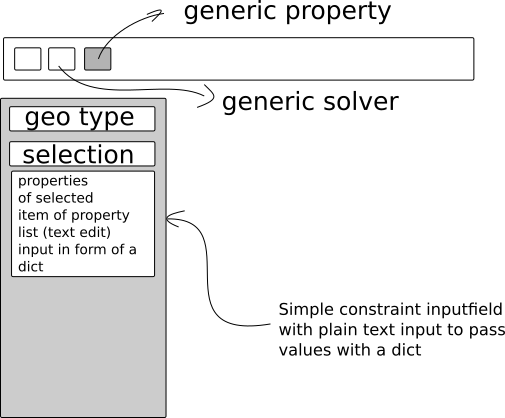

# proposal for a generic fem-solver

## goals

- provide an interface to create geometry-analysis-tools(eg. pde solvers) working on mesh data as plug-ins for FreeCAD.
- adding custom (specific) solvers at runtime without changing the FreeCAD source
- find a generic way to satisfy most use-cases

## structure

#### freecad level
the generic solver is only one FreeCAD class. The solver type is set by choosing from a listproperty. At the moment I can't think of a usecase to implement another solver on FreeCAD-level. (maybe there is?)

#### python level
- GenericSolver
  - FenicsSolver
    - FenicsSteadyStateHeatSolver
    - FenicsHeatSolver *timedepending*
  - other solver types ...


#### GenericSolverApi

```python
class GenericSolver(object):
    def __init__(self, mesh, geo_properties):
        '''pass everything we need inside the solver'''

    def run(self):
        '''to be implemented by subclass'''

    def getSolution(self):
        '''to be implemented by subclass, called by freecad-solver after computation'''

    def convertMesh(self):
        '''implement by subclass'''

    def convertBCs(self):
        '''implement by subclass'''

    def writeMesh(self, filename):
        '''writes the mesh to file'''

    def writeInput(self):
        pass

    def writeOutput(self):
        pass
```

#### Adding a new solver with the console:

```python
from Fem import GenericSolver
class mySolver(GenericSolver):
    ...

Fem.customSolvers.append(mySolver)
# maybe we should check if the solver is already in the list
# so doing it with a special function
Fem.registerSolver(mySolver)

```

## examples

### Heat equation with fenics

the steady state heat equation should be quite simple to implement and could be used as an example for the fenics solver class. To also deal with time depending analysis it makes sense to consider also an example for this use-case.

eg.: https://github.com/hplgit/fenics-tutorial/blob/master/pub/python/vol1/ft01_poisson.py


## generic properties


Multiple pde's need multiple bc and properties. For every kind of pde we could add bc inputs. But then the FEM-workspace will explode. So here is a suggestion to add something like a genericFemProperty editor, which can handle all kind of solver inputs.

The suggestion is to handle bc, material properties, solver options all in one object. This object is basically a list of dicts. Every dict specifies on which type it is acting (solver, volume, face, edge, point) and the data which needs to get mapped to the corresponding mesh (for example this could look like this:
  ```python
  [
  "volume_name":
      {"type": "volume", "density": 1., "lambda": 2},
  "edge_name":
      {"type": "edge", "temperature": 0}
  "other_edge_name":
      {"type": "edge", "conduction": {"temperature": 10., "conductivity": 1.}}
  ]
  ```

### generic-properties editor




## Questions:

- How to pass the input data?
```python
mesh = {
    nodes: [...],
    elements: [...],
    element_groups: {name: [...]},
    node_groups: {name: [...]},
    element_properties: {group_name or element: {property_name: value}},
    node_properties: {group_name or node: {property_name: value}}}
```
- How to deal with solver options. How to pass them from the gui to the solver?
- generic property setter: Can we use there something from the fem-workbench? How to transform properties from Geometry to mesh-data.
- how to deal with time-depending analysis? Is the post-processing already useable for this?


## files of interest:

- get nodes/elements from mesh
https://github.com/looooo/FreeCAD/blob/genericSolver/src/Mod/Fem/FemMeshTools.py#L33

- a call to the solver:
https://github.com/looooo/FreeCAD/blob/genericSolver/src/Mod/Fem/FemToolsZ88.py#L150

- Here the command is added to freecad:
https://github.com/looooo/FreeCAD/blob/genericSolver/src/Mod/Fem/_CommandSolverZ88.py

- Maybe helpful to find out about the structure of the input data:
https://github.com/looooo/FreeCAD/blob/genericSolver/src/Mod/Fem/FemInputWriterZ88.py
